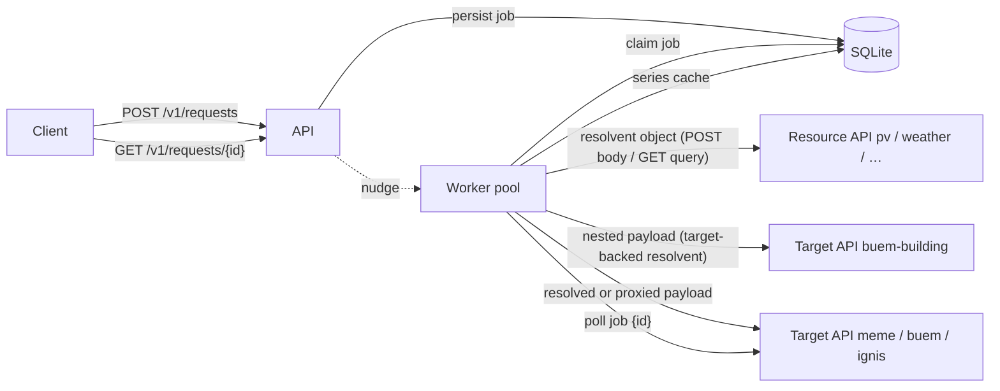
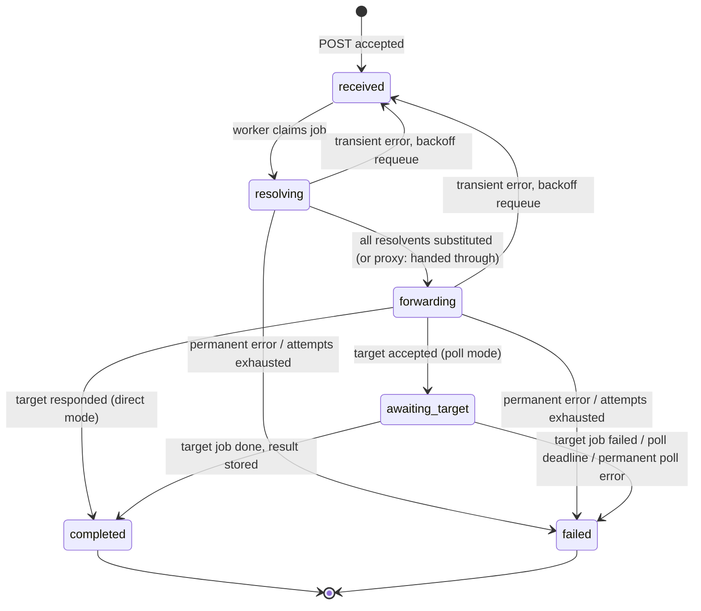

# Architecture

Tentacron is a single Go binary. SQLite serves as both the audit store and the
durable job queue; a worker pool drives each request through resolution,
forwarding and target polling.

## Components



## Request lifecycle



Every transition is appended to the `job_events` table, giving a complete
audit trail per request. Terminal states are final: a late outcome from an
overlapping worker can never overwrite a result a client may already have
seen.

## Resolution

The payload's time-series container is located via the per-target
`timeseries_path` — `model.timeseries` for MEME, the default `time-series`
for the generic examples, or `"."` to scan the whole payload (buem-gateway,
whose `weather` block sits at the root). The container may be an array or a
name→object registry; nested arrays and objects below it are walked too. A
path that addresses a single resolvent object resolves that object itself,
replacing its slot in the parent.
Every object whose `type` starts with `resolvent-` is collected, in
deterministic order (array order, sorted keys). The walk does not descend
into resolvent objects (their fields are opaque backend parameters) nor into
genuine `time-series` objects (data). Unknown resolvent types fail the job
*before* any HTTP call. A missing container is not an error — there is
simply nothing to resolve.

Each distinct resolvent (deduplicated by a canonical SHA-256 hash of its type
and parameters) is fetched concurrently, bounded by
`worker.resolvent_concurrency` — from the series cache when an identical
resolvent was resolved within its TTL, otherwise through its backend:

| Backend | Configured by | Outbound call |
|---|---|---|
| POST resource API | `url` + `method: POST` (or PUT/PATCH) | the resolvent object (or its `payload_field`) as JSON body |
| GET resource API | `url` + `method: GET` | `{field}` placeholders filled from the object, every other field a query parameter |
| Configured target | `target: <direct-mode target>` | the nested payload forwarded through that target, with its URL, auth and timeout |

The response must be a JSON object (optionally narrowed via `response_path`,
which also indexes array responses). It replaces the resolvent object in
place; unless the target sets `attach_resolvent: false`, the original object
moves under the new series' `resolvent` key:

```json
{ "name": "pv", "type": "resolvent-pv1", "capacity_kw": 12.5 }
```

becomes

```json
{
  "type": "time-series", "unit": "kW", "values": [0.1, 0.2],
  "resolvent": { "name": "pv", "type": "resolvent-pv1", "capacity_kw": 12.5 }
}
```

A nested payload sent through a target-backed resolvent is forwarded as-is
and never itself scanned for resolvents, so resolvent recursion is impossible
by construction. Payloads and series are decoded with number fidelity
(`json.Number`), so integers above 2^53 survive the round trip byte-exact.

**Proxy targets** (`proxy: true`) skip resolution entirely: the payload is
stored as its own resolved form and forwarded untouched — byte-exact unless
the target URL carries `{field}` placeholders, which are filled from (and
stripped out of) the payload's top level.

## Queue semantics

SQLite *is* the queue — no external broker:

- Claiming a `received` job is an atomic compare-and-swap
  (`UPDATE … WHERE state = 'received'`); exactly one worker wins. The attempt
  counter is incremented at claim time, so an attempt cut short by a crash
  still counts, and a job that already reached `worker.max_attempts` is
  failed at claim instead of run again.
- Candidates are ordered by `priority` (`-10`..`10`), then round-robin
  across clients — a window function ranks each client's due jobs, every
  client's first comes before any client's second, and among those the
  client served least recently (tracked per claim) goes first — then age. A
  client at
  its `max_concurrent` ceiling is skipped for other clients' work; the
  ceiling is checked inside the claim's write transaction, so concurrent
  workers cannot overshoot it together.
- Poll ticks for `awaiting_target` jobs are claimed by pushing
  `next_attempt_at` forward atomically by the target's poll interval, so
  concurrent workers never poll the same job twice for the same tick.
- Transient failures (network errors, timeouts, HTTP 429/5xx, the job
  timeout) requeue the job with capped exponential backoff and ±20 % jitter;
  permanent failures (other non-2xx statuses including redirects, oversized
  responses, malformed resource bodies, unknown resolvent, target job failed)
  fail it immediately. A target configured with `retry_on_timeout: false`
  turns a deadline hit on its forward into a permanent `target_timeout`, so
  an expensive synchronous simulation is never submitted twice; per-target
  `job_timeout` and `max_attempts` override the worker defaults.
- Workers wake on a nudge from the API when a job is accepted and otherwise
  every `worker.poll_interval` to pick up scheduled retries and poll ticks.

## Restart safety

- On startup, jobs stuck in `resolving`/`forwarding` are requeued. Processing
  restarts from the stored original payload; the series cache makes the redo
  cheap.
- Jobs in `awaiting_target` keep their state and resume polling — the target
  job is never submitted twice.
- The housekeeping sweeper additionally rescues jobs left in
  `resolving`/`forwarding` without a schedule while the process kept running
  (a failed bookkeeping write) once they have been untouched for twice
  `worker.job_timeout`.
- On shutdown, the HTTP server drains first, then workers abort their
  upstream calls and park in-flight jobs back to `received`.

## Trust and security

- Client API keys are checked in constant time and never persisted: the key is
  stripped before the payload is stored.
- Target/resource credentials live only in the YAML config (via environment
  variables) and are injected into outbound requests at send time.
- All outbound URLs come from configuration — request data can only select
  dictionary entries, never supply a URL. Values that do reach a URL are
  path-escaped: target-supplied job ids are additionally validated against a
  strict charset before they are substituted into poll/result URL templates,
  and `{field}` placeholders accept only string or number values.
- Outbound calls never follow redirects (Go's default policy would forward
  the injected API-key headers to cross-origin redirect targets), and
  upstream error excerpts have all configured credentials redacted before
  they are stored or logged.
- Request and response bodies are size-capped (`server.max_body_bytes`); TLS
  termination is expected at a reverse proxy.

Prometheus metrics are deliberately deferred; the structured logs and the
`job_events` audit trail cover observability for a single-instance v1.
