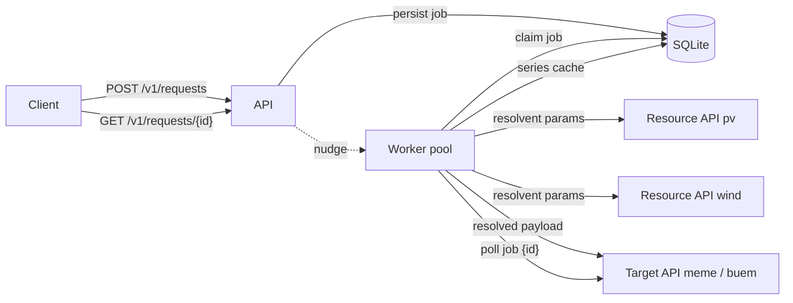
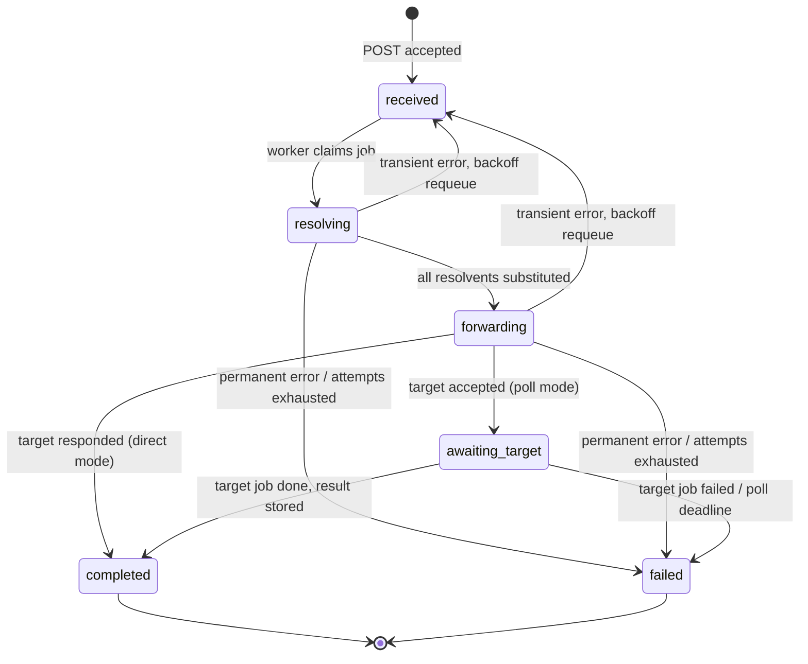

# Architecture

Tentacron is a single Go binary. SQLite serves as both the audit store and the
durable job queue; a worker pool drives each request through resolution,
forwarding and target polling.

## Components



## Request lifecycle



Every transition is appended to the `job_events` table, giving a complete
audit trail per request.

## Resolution

The payload's time-series container is located via the per-target
`timeseries_path` (e.g. `model.timeseries` for MEME, `time-series` for buem).
Inside it, every object whose `type` starts with `resolvent-` is collected.
Unknown resolvent types fail the job *before* any HTTP call.

Each distinct resolvent (deduplicated by a canonical SHA-256 hash of its
parameters) is fetched concurrently — from the series cache when an identical
resolvent was resolved within its TTL, otherwise from the configured resource
API. The response replaces the resolvent object in place; the original object
moves under the new series' `resolvent` key:

```json
{ "name": "pv", "type": "resolvent-pv1", "capacity_kw": 12.5 }
```

becomes

```json
{
  "type": "time-series", "unit": "kW", "values": [0.1, 0.2],
  "resolvent": { "name": "pv", "type": "resolvent-pv1", "capacity_kw": 12.5 }
}
```

## Queue semantics

SQLite *is* the queue — no external broker:

- Claiming a `received` job is an atomic compare-and-swap
  (`UPDATE … WHERE state = 'received'`); exactly one worker wins.
- Poll ticks for `awaiting_target` jobs are claimed by pushing
  `next_attempt_at` forward atomically, so concurrent workers never poll the
  same job twice for the same tick.
- Transient failures (network errors, timeouts, HTTP 429/5xx) requeue the job
  with capped exponential backoff and ±20 % jitter; permanent failures (4xx,
  unknown resolvent, target job failed) fail it immediately.

## Restart safety

- On startup, jobs stuck in `resolving`/`forwarding` are requeued. Processing
  restarts from the stored original payload; the series cache makes the redo
  cheap.
- Jobs in `awaiting_target` keep their state and resume polling — the target
  job is never submitted twice.
- On shutdown, the HTTP server drains first, then workers abort their
  upstream calls and park in-flight jobs back to `received`.

## Trust and security

- Client API keys are checked in constant time and never persisted: the key is
  stripped before the payload is stored.
- Target/resource credentials live only in the YAML config (via environment
  variables) and are injected into outbound requests at send time.
- All outbound URLs come from configuration — request data can only select
  dictionary entries, never supply a URL. Target-supplied job ids are
  validated against a strict charset and path-escaped before they are
  substituted into poll/result URL templates.
- Outbound calls never follow redirects (Go's default policy would forward
  the injected API-key headers to cross-origin redirect targets), and
  upstream error excerpts have all configured credentials redacted before
  they are stored or logged.
- Request and response bodies are size-capped; TLS termination is expected at
  a reverse proxy.

Prometheus metrics are deliberately deferred; the structured logs and the
`job_events` audit trail cover observability for a single-instance v1.
